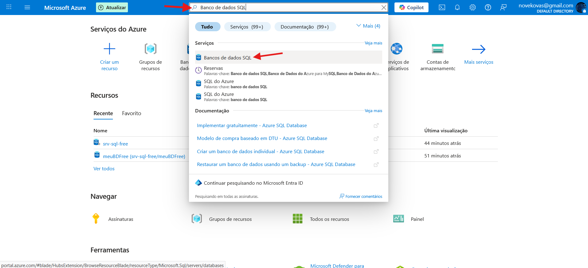
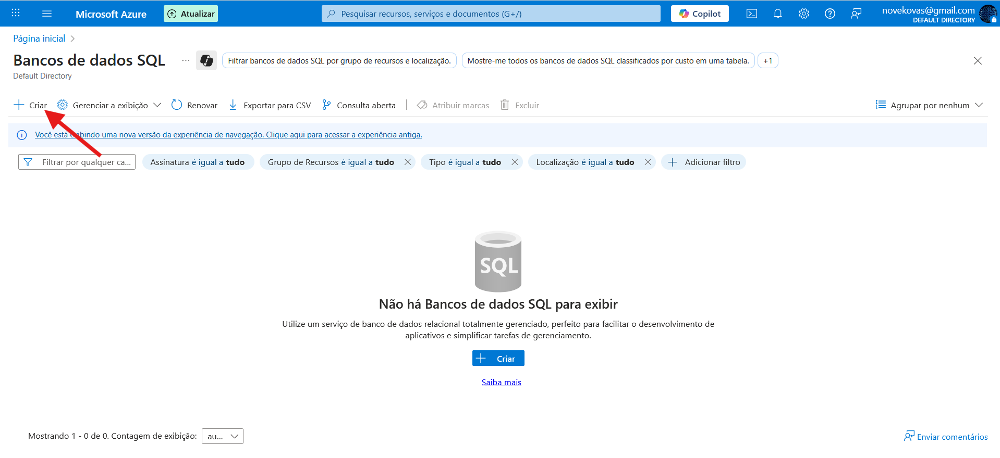
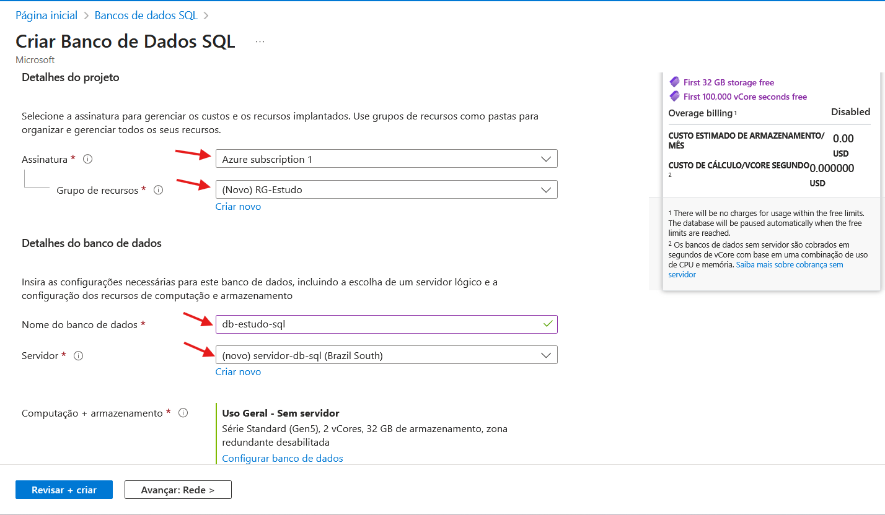
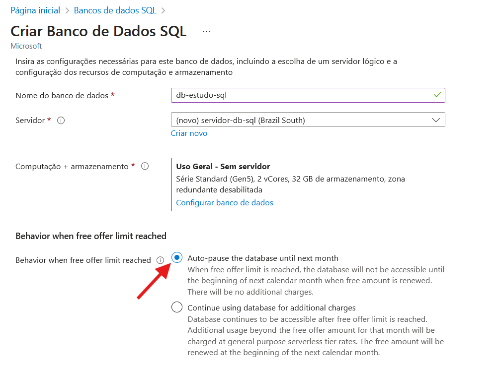
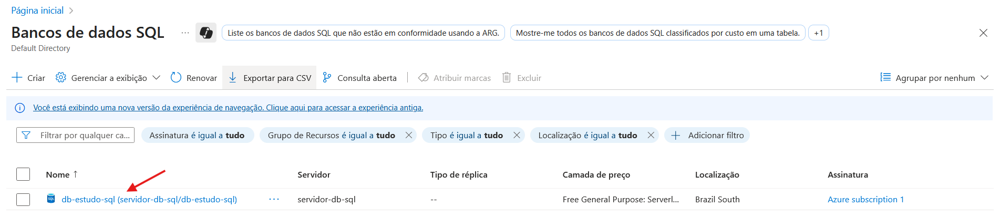
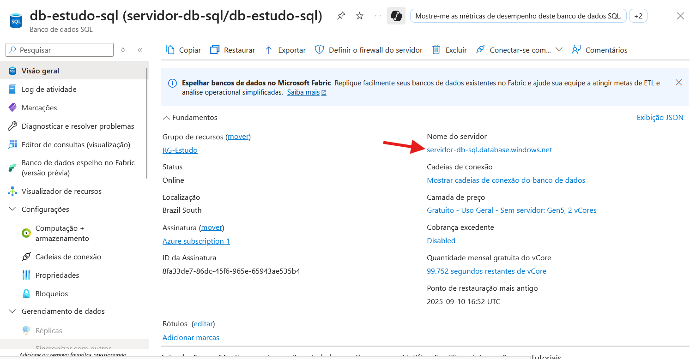
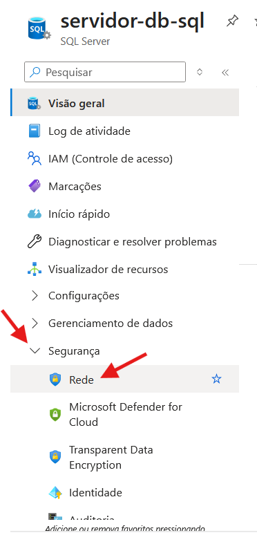
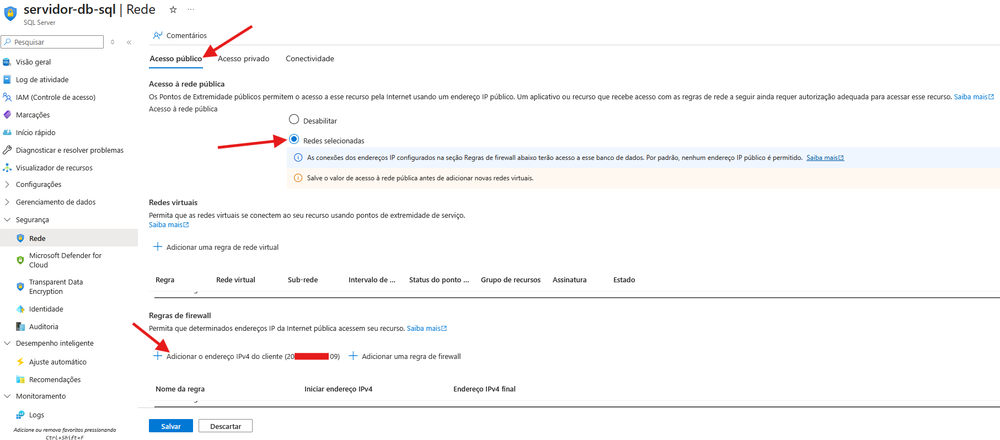

# Criando um Banco de Dados SQL no Microsoft Azure

## 📝 Descrição
Este documento tem como finalidade documentar o processo básico para a criação de um banco de dados SQL via portal do **Microsoft Azure**.  
O objetivo é auxiliar nos estudos, demonstrando a criação, configuração e acesso ao banco diretamente pelo **VSCode**.

---

## 📌 Pré-requisitos
- Conta ativa no [Microsoft Azure](https://portal.azure.com/)  
- Permissão para criar recursos na assinatura desejada  

---

## 🚀 Passo a passo para criação do Banco de Dados SQL

### 1) Acessar o portal do Azure
Entre no portal [Microsoft Azure](https://portal.azure.com/).

---

### 2) Localizar o serviço de Banco de Dados SQL
No menu de pesquisa do portal, digite **"Banco de dados SQL"** e clique no serviço **"Banco de dados SQL"**.  


---

### 3) Criar um novo Banco de Dados SQL
Assim que abrir o painel do serviço **Bancos de dados SQL**, clique em **Criar**.  


---

### 4) Preencher informações:
No formulário de criação, informe os seguintes dados:  
- **Assinatura** → Defina em qual assinatura o recurso será alocado  
- **Grupo de recurso** → Grupo de recursos no qual os objetos serão criados  
- **Nome do banco de dados**  
- **Servidor** → Servidor responsável pela execução do SQL  



---

### 5) Configurar pausa automática (para estudos)
Como o objetivo é apenas **criar um banco para estudos**, marque a opção:  
✔️ **Pausar automaticamente o banco de dados até o mês que vem**  



---

## Acessando o Banco de Dados

### 1) Localizar o Banco de Dados
No portal do Azure, pesquise novamente por **Banco de dados SQL** e clique no banco que deseja configurar.  


---

### 2) Acessar o servidor SQL
Clique no recurso exibido abaixo de **Nome do servidor**.  


---

### 3) Configurar regras de firewall
No menu lateral à esquerda, clique em **Segurança → Rede**.  


---

### 4) Configurar regre de firewall
Na seção **Acesso público**, selecione **Redes selecionadas** e, em **Regras de firewall**, adicione o **seu IP público**.  


---

### 4) Conectar via VSCode
Abra o **VSCode**, configure a conexão utilizando os dados do servidor configurados na etapa **4.4**.  

---

### 5) Validar conexão
Após conectar, execute a query:

```sql
SELECT @@VERSION;
```

Sua saída será algo como o apresentado abaixo:
```
Microsoft SQL Azure (RTM) - 12.0.xxxxx ...
```

---

## 📖 Referências
- [DIO - Formação Microsoft AZ-900 Certification](https://web.dio.me/track/formacao-microsoft-az-900-certification)
- [Documentação oficial - Implantar o Banco de Dados SQL do Azure gratuitamente](https://learn.microsoft.com/pt-br/azure/azure-sql/database/free-offer?view=azuresql)
